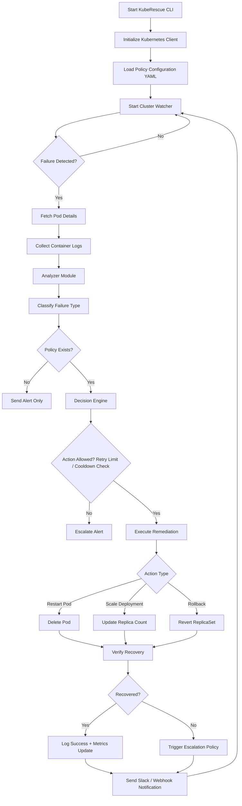

# KubeRescue
Autonomous Kubernetes failure detection and policy-driven auto-remediation engine for SRE teams.

```mermaid
flowchart TD
    A[Start KubeRescue CLI] --> B[Initialize Kubernetes Client]
    B --> C[Load Policy Configuration YAML]
    C --> D[Start Cluster Watcher]

    D --> E{Failure Detected?}

    E -- No --> D
    E -- Yes --> F[Fetch Pod Details]
    F --> G[Collect Container Logs]

    G --> H[Analyzer Module]
    H --> I[Classify Failure Type]

    I --> J{Policy Exists?}

    J -- No --> K[Send Alert Only]
    J -- Yes --> L[Decision Engine]

    L --> M{Action Allowed? Retry Limit / Cooldown Check}

    M -- No --> N[Escalate Alert]
    M -- Yes --> O[Execute Remediation]

    O --> P{Action Type}

    P --> |Restart Pod| Q[Delete Pod]
    P --> |Scale Deployment| R[Update Replica Count]
    P --> |Rollback| S[Revert ReplicaSet]

    Q --> T[Verify Recovery]
    R --> T
    S --> T

    T --> U{Recovered?}

    U -- Yes --> V[Log Success + Metrics Update]
    U -- No --> W[Trigger Escalation Policy]

    V --> X[Send Slack / Webhook Notification]
    W --> X

    X --> D
```
