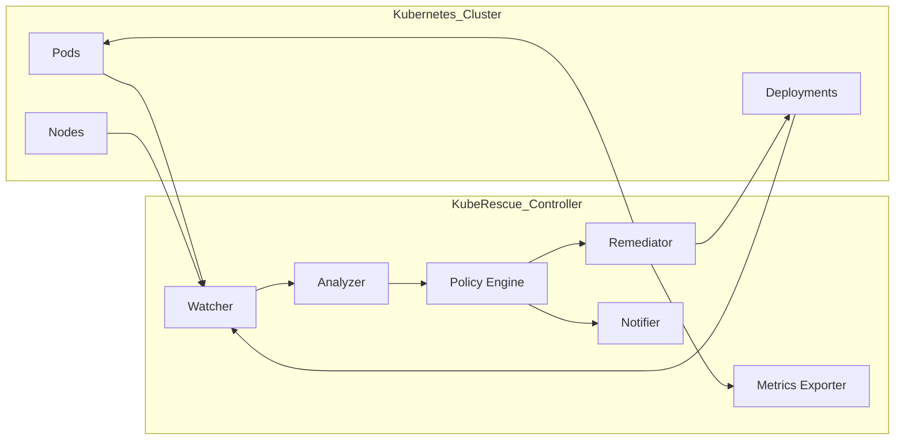
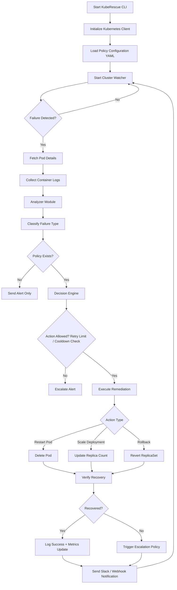

### KubeRescue

> ⚠️ **Status: Alpha – Under Active Development. Not Production Ready.**

Autonomous Kubernetes failure detection and policy-driven auto-remediation engine for SRE and platform engineering teams.

KubeRescue is designed to reduce operational toil by automatically detecting workload failures and applying safe, policy-driven remediation strategies inside Kubernetes clusters.

---

## ⚠️ Project Status

KubeRescue is currently under active development and testing.

This project is **not production-ready** and must **NOT** be deployed in production environments at this time.

Features, APIs, and behavior may change without notice as the architecture evolves.

Use only in development or staging clusters.

---

Modern Kubernetes environments require continuous monitoring and rapid remediation of failures such as:

- CrashLoopBackOff
- OOMKilled containers
- ImagePullBackOff
- Misconfigured deployments
- Restart storms

KubeRescue aims to implement:

```
Detection → Classification → Policy Evaluation → Safe Remediation → Observability
```

With SRE-grade safety controls such as:

- Retry limits
- Cooldown windows
- Idempotent actions
- Escalation policies
- Metrics export

---

### High-Level Controller Architecture



---

### Workflow Execution Flow



---

### Current Features (Alpha)

- CrashLoopBackOff detection
- Automated pod restart
- Strict type checking (mypy)
- Security scanning (Bandit)
- Linting (Ruff)
- Code formatting (Black)
- Pre-commit enforcement
- CI pipeline ready

---

### Run CLI (Development Only)

```bash
kubrescue monitor --namespace default
```

---

### Engineering Principles

KubeRescue is built with the following principles:

- Safety over aggression
- Explicit remediation policies
- Idempotent operations
- Observable actions
- Strong typing and lint enforcement
- Security scanning by default

---

### Roadmap

- Retry & cooldown protection engine
- Kubernetes Watch API integration
- Policy-based YAML configuration
- Slack / webhook notifier
- Prometheus metrics exporter
- Helm chart deployment
- Docker image distribution
- Multi-namespace support

---
