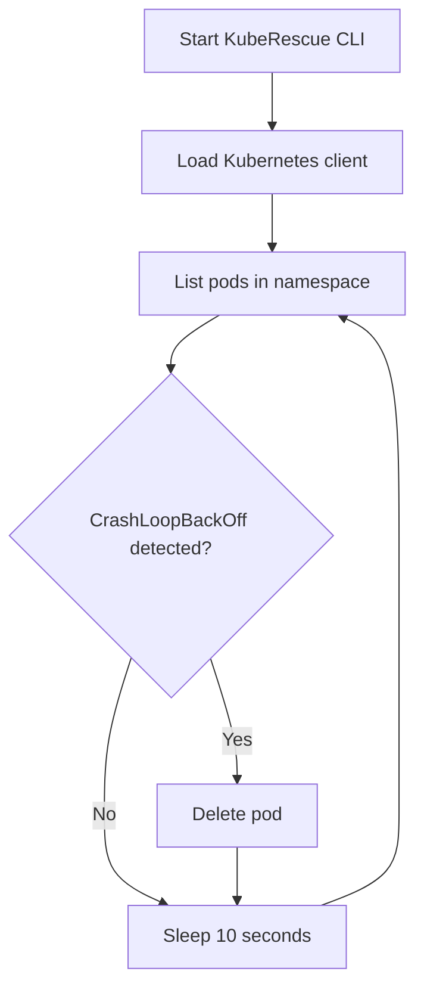
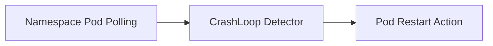

# KubeRescue

KubeRescue is a Kubernetes auto-remediation project focused on reducing operational toil in development and staging clusters.

Phase 1 is intentionally narrow: detect pods stuck in `CrashLoopBackOff` and restart them by deleting the pod so its controller can recreate it.

## Phase 1 Status

KubeRescue is currently an early MVP and is not production-ready.

Current scope:

- Detect `CrashLoopBackOff` pod states
- Continuously watch a single namespace using the Kubernetes Python client
- Restart failed pods by deleting them through the Kubernetes API
- Provide a small CLI entrypoint for local development and testing

Not in Phase 1 yet:

- Retry limits and cooldown windows
- Policy-driven remediation rules
- Slack or webhook notifications
- Prometheus metrics
- Rollback or scale actions
- Helm chart or production deployment support

Use this project only in development or staging clusters until safety controls are implemented.

## Why This Project Exists

Kubernetes failures such as `CrashLoopBackOff` often create noisy, repetitive operational work during development and testing. KubeRescue explores a safer path toward automated remediation, starting with one narrow and understandable recovery action.

The long-term vision is:

`Detection -> Classification -> Policy Evaluation -> Safe Remediation -> Observability`

Phase 1 only delivers the first step of that journey for a single failure mode.

## How Phase 1 Works



## Current Architecture



## Installation

```bash
python -m venv .venv
source .venv/bin/activate
pip install -e .
```

If you want development tooling as well:

```bash
pip install -e ".[dev]"
```

## Usage

KubeRescue uses in-cluster Kubernetes configuration first and falls back to your local kubeconfig automatically.

Run the Phase 1 monitor against a namespace:

```bash
kubrescue monitor --namespace default
```

When a pod enters `CrashLoopBackOff`, KubeRescue deletes that pod and lets its owning controller recreate it.

## Safety Notes

Current behavior is intentionally simple, which also means it has important limitations:

- There is no retry budget
- There is no cooldown protection
- There is no remediation policy layer
- There is no notification or audit sink beyond console output

Because of that, this repository should be treated as an MVP for experimentation, not an unattended production controller.

## Developer Tooling

The repository already includes basic quality gates:

- `pytest` for tests
- `mypy` for type checking
- `ruff` and `flake8` for linting
- `black` for formatting
- `bandit` for security scanning
- GitHub Actions CI for automated checks

## Roadmap

Planned next steps after Phase 1:

1. Add retry limits and cooldown windows
2. Replace polling with Kubernetes watch streams
3. Introduce policy-based remediation configuration
4. Add notifications and observability
5. Package the project for cluster deployment

## Contributing

This project is still evolving quickly. If you want to contribute, the most helpful areas right now are:

- Safer remediation controls
- Better failure classification
- Local demo environments and examples
- Tests around watcher and remediation behavior

## Vision

KubeRescue aims to become a safe and policy-aware remediation engine for Kubernetes operators. The path to that goal is to earn trust one small, verifiable feature at a time.
